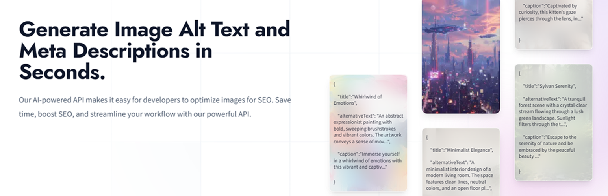
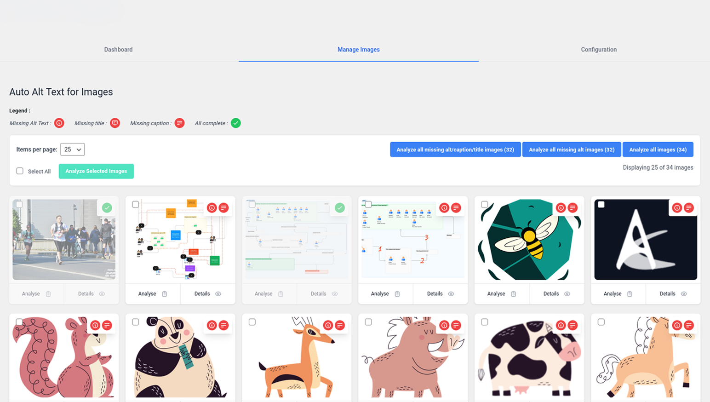
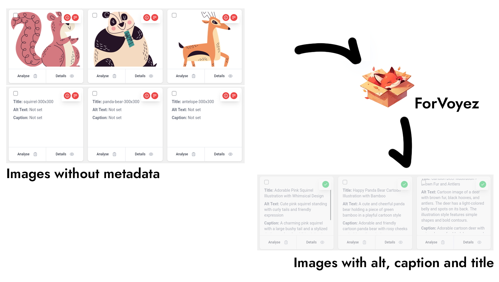
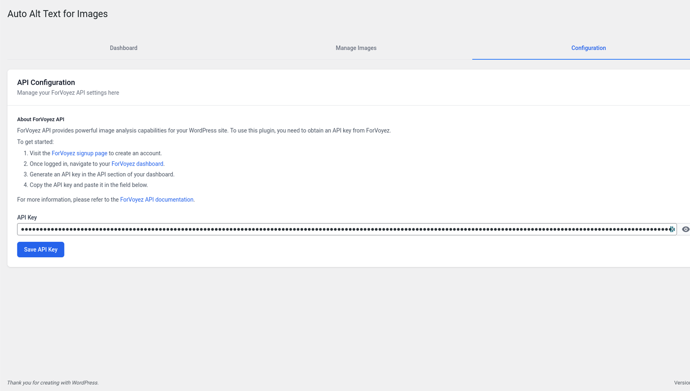

# Auto Alt Text for Images

Automatically generate SEO-friendly alt text, titles, and captions for your images using AI technology.

## Description

Auto Alt Text for Images is a powerful WordPress plugin that leverages AI technology to automatically generate high-quality alt text, titles, and captions for your images. This plugin helps improve your website's SEO and accessibility by ensuring all your images have meaningful and descriptive metadata.

### Key Features

- 🚀 Automatic generation of alt text, titles, and captions
- 🖼️ Bulk processing of existing images
- 🔗 Seamless integration with the WordPress media library
- 🛠️ Customizable output formats
- 🌐 Support for multiple languages
- 👥 User-friendly interface within the WordPress admin area

This plugin uses the ForVoyez API to analyze your images and generate appropriate metadata. You'll need a ForVoyez API key to use this plugin.

## Installation

1. Download the plugin zip file or install directly from WordPress plugin repository.
2. Upload the `forvoyez-auto-alt-text-for-images` folder to the `/wp-content/plugins/` directory if manually uploading.
3. Activate the plugin through the 'Plugins' menu in WordPress.
4. Navigate to the 'Auto Alt Text' settings page in your WordPress admin area.
5. Enter your ForVoyez API key.
6. Start generating alt text for your images!

## Usage

1. After installation and activation, go to the "Auto Alt Text" menu in your WordPress admin panel.
2. Enter your ForVoyez API key in the settings page.
3. Use the "Bulk Process" option to generate metadata for existing images.
4. For new image uploads, metadata will be generated automatically.
5. You can manually edit generated metadata for individual images if needed.

## Frequently Asked Questions

### Do I need an API key to use this plugin?

Yes, you need a ForVoyez API key to use this plugin. You can obtain one by signing up at [https://forvoyez.com](https://forvoyez.com).

### Can I customize the generated alt text?

While the plugin automatically generates alt text, you can always manually edit the generated text for each image if needed.

### Does this plugin work with all image formats?

The plugin works with most common image formats supported by WordPress, including JPEG, PNG, GIF, and WebP.

### Will this plugin slow down my website?

No, the plugin processes images in the background and doesn't affect your website's front-end performance.

## Screenshots

1. Main dashboard of the Auto Alt Text for Images plugin
   

2. Settings page where you can enter your API key
   

3. Bulk processing interface for existing images
   

4. Individual image editing screen with generated metadata
   

## Changelog

### 1.0.0
- Initial release

## Upgrade Notice

### 1.0.0
This is the first release of Auto Alt Text for Images. Install now to start optimizing your image metadata!

## Privacy Policy

Auto Alt Text for Images uses the ForVoyez API to analyze images and generate metadata. The plugin sends image data to ForVoyez servers for processing. No personal data is collected or stored by the plugin itself. For more information on how ForVoyez handles data, please refer to their privacy policy at [https://forvoyez.com/privacy](https://forvoyez.com/privacy).

## Support

If you encounter any issues or have questions, please [open an issue](https://github.com/yourusername/auto-alt-text-for-images/issues) on our GitHub repository.

## Contributing

We welcome contributions! Please read our [contributing guidelines](CONTRIBUTING.md) before submitting pull requests.

## License

This project is licensed under the GPL-2.0+ License - see the [LICENSE](LICENSE) file for details.

---

Made with ❤️ by [ForVoyez](https://forvoyez.com)