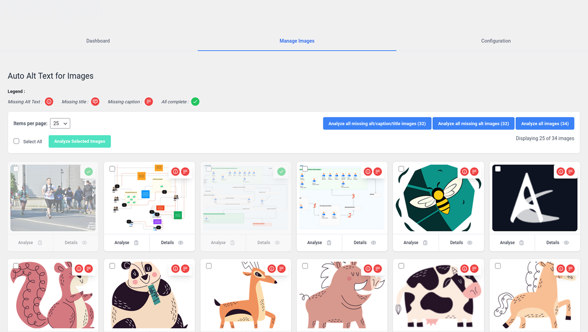
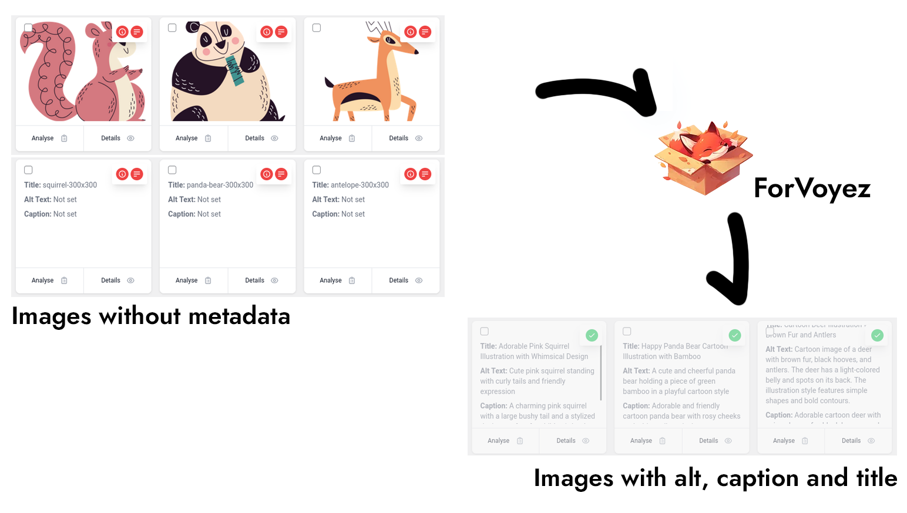
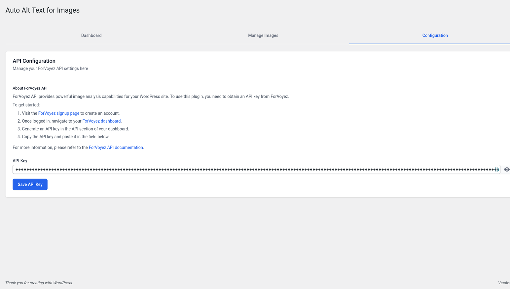

# ForVoyez Auto Alt Text for Images


[](https://wordpress.org/)
[](https://php.net/)
[](https://www.gnu.org/licenses/gpl-2.0.html)

_A powerful WordPress plugin for the [ForVoyez](https://forvoyez.com) platform that automatically generates SEO-optimized alt text for images._

## Table of Contents

- [Description](#description)
- [Features](#features)
- [Requirements](#requirements)
- [Installation](#installation)
- [Configuration](#configuration)
- [Usage](#usage)
- [Development](#development)
- [BrowserSync Configuration](#browsersync-configuration)

## Description

ForVoyez Auto Alt Text for Images is a WordPress plugin that leverages AI technology to automatically generate high-quality, SEO-friendly alt text for images in your content. This plugin enhances your website's accessibility and search engine optimization effortlessly.

## Features

- 🤖 AI-powered alt text generation
- 🖼️ Bulk processing for existing images
- 🔄 Automatic processing for new uploads
- 🎨 Customizable output formats
- 🌐 Multi-language support
- 🧰 User-friendly WordPress admin interface

## Requirements

- WordPress 5.6 or higher
- PHP 8.0 or higher
- Composer
- Node.js and npm

## Installation

1. Download the plugin zip file or clone the repository:

   ```sh
   git clone https://github.com/For-Hives/ForVoyez-Wordpress-plugin.git auto-alt-text-for-images
   ```

2. Navigate to the plugin directory:

   ```sh
   cd auto-alt-text-for-images
   ```

3. Install PHP dependencies:

   ```sh
   composer install
   ```

4. Install Node.js dependencies:

   ```sh
   npm install
   ```

5. Activate the plugin through the WordPress admin interface.

### Admin page styles

The admin page uses Tailwind CSS classes compiled into `assets/css/admin-tailwind.css` (committed, no CDN). After changing Tailwind classes in `templates/`, `includes/` or `assets/js/admin-script.js`, rebuild it:

```sh
npm run build:css
```

## Configuration

1. Go to the ForVoyez Auto Alt Text settings page in your WordPress admin area.
2. Enter your ForVoyez API key.
3. Configure any additional settings according to your preferences.

## Usage

After installation and configuration:

1. The plugin will automatically generate alt text for new image uploads.
2. To process existing images:
   - Go to Media Library
   - Select the images you want to process
   - Choose "Generate Alt Text" from the bulk actions dropdown
3. You can manually edit any generated alt text as needed.

## Development

### BrowserSync Configuration

To use BrowserSync with your WordPlate project:

1. Create a `bs-config.cjs` file in the project root:

   ```js
   module.exports = {
   	proxy: 'localhost:8000', // Replace with your PHP server port
   	files: [
   		'public/**/*.php',
   		'resources/**/*.php',
   		'public/**/*.css',
   		'public/**/*.js',
   	],
   	notify: false,
   }
   ```

2. Start the PHP server:

   ```sh
   php -S localhost:8000 -t public
   ```

3. Start BrowserSync:
   ```sh
   browser-sync start --config bs-config.cjs
   ```

BrowserSync will now monitor specified files and auto-reload your browser on changes.

### Project Structure

```
├── assets/
├── includes/
├── templates/
├── tests/
├── bs-config.cjs
├── composer.json
├── package.json
├── auto-alt-text-for-images.php
├── README.md
└── ...
```

## Debugging and Troubleshooting

If you want to know what is going on, install and run the plugin.
Then, in the code, add the following line:

```php
error_log(print_r($variable, true));
```

This will print the variable to the PHP error log. You can find the log file location in your PHP configuration.
search for `error_log` in your `php.ini` file.
for linux it is usually `/var/log/php/php_error.log`
for windows it is usually `C:\php\logs\php_error.log` or `C:\wamp64\logs\php_error.log`
you can also use `phpinfo()` to find the log file location.

then to stream the log file to your terminal, use the following command:

```sh
tail -f /var/log/php/php_error.log
```
and for windows :
```sh
Get-Content C:\php\logs\php_error.log -Wait -Tail 10
Get-Content C:\wamp64\logs\php_error.log -Wait -Tail 10
```

## Screenshots

1. **API Configuration**
   
   The plugin's configuration interface allows easy setup of your ForVoyez API key. This page provides step-by-step instructions on how to obtain and configure your API key to start using the plugin.

2. **Image Management Interface**
   
   The main image management dashboard of the plugin. It displays a grid view of your WordPress media library with visual indicators for missing metadata. Users can easily select and analyze images individually or in bulk.

3. **Results Example**
   
   This screenshot showcases the plugin's ability to generate high-quality alt text and meta descriptions. It displays examples of automatically generated titles, alt texts, and captions for a variety of image types, demonstrating the AI's versatility and accuracy.


Certainly. Here's the README section in English:

## Test Environment Setup

To run the tests for this plugin, you'll need a MySQL/MariaDB database with a root user having all privileges. Here are the steps to set up your environment:

### Prerequisites

- MySQL or MariaDB installed
- Composer
- PHP 8.0 or higher

### Database Configuration

1. Log in to MySQL as root:

   ```
   sudo mysql -u root -p
   ```

   Enter the root password if prompted.

2. Grant all privileges to the root user:

   ```sql
   GRANT ALL PRIVILEGES ON *.* TO 'root'@'localhost' WITH GRANT OPTION;
   FLUSH PRIVILEGES;
   ```

3. If the above command fails, follow these troubleshooting steps:

   a. Stop the MariaDB service:
      ```
      sudo systemctl stop mariadb
      ```
      
   b. Ensure no MySQL processes are running:
      ```
      ps aux | grep mysql
      ```
      If processes are found, stop them:
      ```
      sudo kill -9 [PID]
      ```

   c. Start MySQL in safe mode:
      ```
      sudo mysqld_safe --skip-grant-tables --skip-networking &
      ```

   d. Repair the database tables:
      ```
      sudo mysqlcheck -u root --repair --all-databases
      ```
      or
      ```
      sudo mysqlcheck -u root --skip-password --repair --all-databases
      ```

   e. Log in to MySQL and reset the root password:
      ```
      mysql -u root
      ```
      ```sql
      FLUSH PRIVILEGES;
      USE mysql;
      ALTER USER 'root'@'localhost' IDENTIFIED BY 'root';
      FLUSH PRIVILEGES;
      EXIT;
      ```

   f. Restart MySQL normally and grant privileges:
      ```
      sudo systemctl start mariadb
      mysql -u root -p
      ```
      ```sql
      GRANT ALL PRIVILEGES ON *.* TO 'root'@'localhost' WITH GRANT OPTION;
      FLUSH PRIVILEGES;
      ```

### Running the setup Tests

Once the database is configured, you can run the install db tests with the following command:

```
composer run install-wp-tests
```

This command will install the WordPress test environment and run the plugin's unit tests.
If you encounter any issues while running the tests, make sure the database connection information in the `bin/install-wp-tests.sh` file is correct.

To use an existing database instead (for example a throwaway MariaDB container), pass `host:port` and `true` as the 6th argument to skip the database creation:

```
docker run -d --name wp-tests-db -e MARIADB_ROOT_PASSWORD=root -e MARIADB_DATABASE=wordpress_test -e MARIADB_USER=wp_test_user -e MARIADB_PASSWORD=votre_mot_de_passe_test -p 127.0.0.1:33069:3306 mariadb:11.8
bash bin/install-wp-tests.sh wordpress_test wp_test_user votre_mot_de_passe_test 127.0.0.1:33069 latest true
```

### Running the tests

To run the tests, use the following command:

```
./vendor/bin/phpunit [file path].php
```

If the test suite was installed outside the default temporary directory, point `WP_TESTS_DIR` at it (for example `WP_TESTS_DIR=/path/to/wordpress-tests-lib ./vendor/bin/phpunit`).

The tests never call the real ForVoyez API: HTTP requests are intercepted with the `pre_http_request` filter (see `tests/TestForvoyezApiHttp.php`).

GitHub Actions runs `php -l` and the PHPUnit suite on PHP 8.0, 8.2 and 8.4 against MariaDB on every push and pull request, and checks that `assets/css/admin-tailwind.css` is committed and up to date (`.github/workflows/tests.yml`).

### Add a new version 
Versions are bumped and released by GitHub Actions; do not change the version numbers by hand.

- Every push to `main` whose commit message does not contain `✨ Release version` runs `.github/workflows/version-bump.yml`: it reads the version from package.json, increments the patch number, writes it to package.json, the plugin header and `FORVOYEZ_VERSION` (auto-alt-text-for-images.php) and the readme.txt `Stable tag`, then commits `✨ Release version X.Y.Z ✨` and tags it.
- That commit triggers `.github/workflows/deploy.yaml`, which builds the admin CSS, the translations and the zip, creates the GitHub release (with CHANGELOG.md as its body) and publishes to WordPress.org.
- Before merging, write the changelog under the next version (current version + 1): CHANGELOG.md, the readme.txt `== Changelog ==` and, if needed, `== Upgrade Notice ==`.
- Run `npm run build:css` if Tailwind classes changed and commit `assets/css/admin-tailwind.css`.
- Run `composer run make-pot` if translatable strings changed.


To add a new language, simply run the command:
`composer run add-language [language_code]`
For example, to add Spanish:
`composer run add-language es_ES`
The created files will need to be translated either manually or using a translation editor like Poedit. Once translated, they must be compiled into MO files to be used by WordPress.


---

Made with ❤️ by [ForVoyez](https://forvoyez.com)
