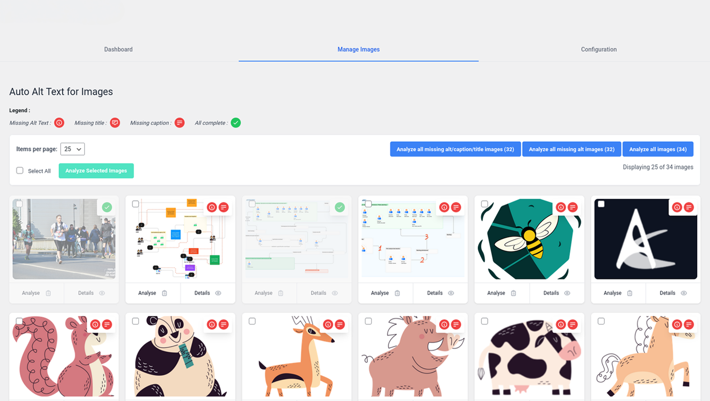
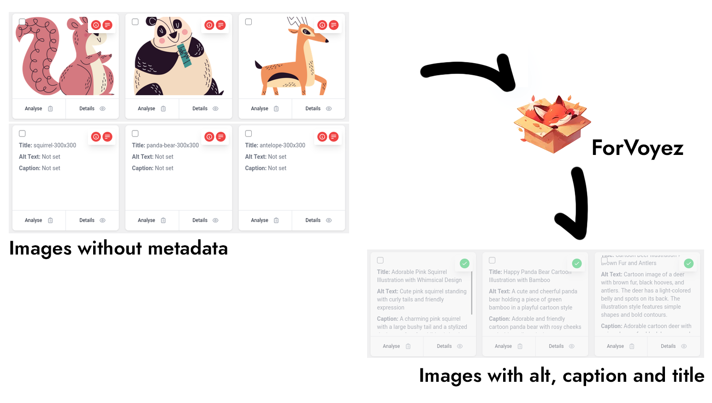
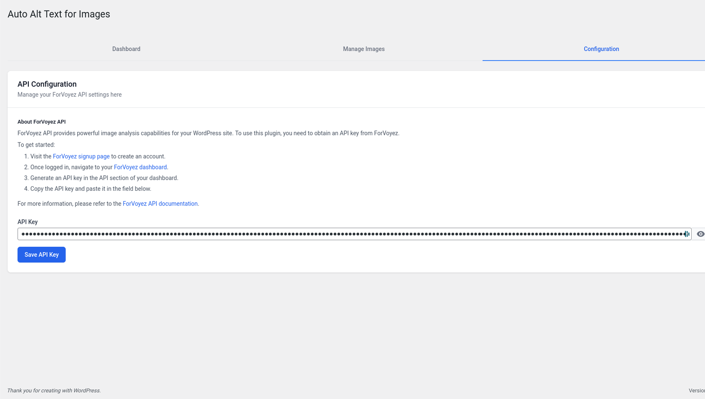

# ForVoyez Auto Alt Text for Images


[](https://wordpress.org/)
[](https://php.net/)
[](https://www.gnu.org/licenses/gpl-2.0.html)

_A powerful WordPress plugin for the [ForVoyez](https://forvoyez.com) platform that automatically generates SEO-optimized alt text for images._

## Table of Contents

- [Description](#description)
- [Features](#features)
- [Requirements](#requirements)
- [Installation](#installation)
- [Configuration](#configuration)
- [Usage](#usage)
- [Development](#development)
- [BrowserSync Configuration](#browsersync-configuration)

## Description

ForVoyez Auto Alt Text for Images is a WordPress plugin that leverages AI technology to automatically generate high-quality, SEO-friendly alt text for images in your content. This plugin enhances your website's accessibility and search engine optimization effortlessly.

## Features

- 🤖 AI-powered alt text generation
- 🖼️ Bulk processing for existing images
- 🔄 Automatic processing for new uploads
- 🎨 Customizable output formats
- 🌐 Multi-language support
- 🧰 User-friendly WordPress admin interface

## Requirements

- WordPress 5.0 or higher
- PHP 8.2 or higher
- Composer
- Node.js and npm

## Installation

1. Download the plugin zip file or clone the repository:

   ```sh
   git clone https://github.com/forvoyez/auto-alt-text-for-images.git
   ```

2. Navigate to the plugin directory:

   ```sh
   cd auto-alt-text-for-images
   ```

3. Install PHP dependencies:

   ```sh
   composer install
   ```

4. Install Node.js dependencies:

   ```sh
   npm install
   ```

5. Activate the plugin through the WordPress admin interface.

## Configuration

1. Go to the ForVoyez Auto Alt Text settings page in your WordPress admin area.
2. Enter your ForVoyez API key.
3. Configure any additional settings according to your preferences.

## Usage

After installation and configuration:

1. The plugin will automatically generate alt text for new image uploads.
2. To process existing images:
   - Go to Media Library
   - Select the images you want to process
   - Choose "Generate Alt Text" from the bulk actions dropdown
3. You can manually edit any generated alt text as needed.

## Development

### BrowserSync Configuration

To use BrowserSync with your WordPlate project:

1. Create a `bs-config.cjs` file in the project root:

   ```js
   module.exports = {
   	proxy: 'localhost:8000', // Replace with your PHP server port
   	files: [
   		'public/**/*.php',
   		'resources/**/*.php',
   		'public/**/*.css',
   		'public/**/*.js',
   	],
   	notify: false,
   }
   ```

2. Start the PHP server:

   ```sh
   php -S localhost:8000 -t public
   ```

3. Start BrowserSync:
   ```sh
   browser-sync start --config bs-config.cjs
   ```

BrowserSync will now monitor specified files and auto-reload your browser on changes.

### Project Structure

```
├── assets/
├── includes/
├── templates/
├── tests/
├── bs-config.cjs
├── composer.json
├── package.json
├── forvoyez-auto-alt-text-for-images.php
├── README.md
└── ...
```

## Screenshots

1. **API Configuration**
   
   The plugin's configuration interface allows easy setup of your ForVoyez API key. This page provides step-by-step instructions on how to obtain and configure your API key to start using the plugin.

2. **Image Management Interface**
   
   The main image management dashboard of the plugin. It displays a grid view of your WordPress media library with visual indicators for missing metadata. Users can easily select and analyze images individually or in bulk.

3. **Results Example**
   
   This screenshot showcases the plugin's ability to generate high-quality alt text and meta descriptions. It displays examples of automatically generated titles, alt texts, and captions for a variety of image types, demonstrating the AI's versatility and accuracy.

---

Made with ❤️ by [ForVoyez](https://forvoyez.com)
